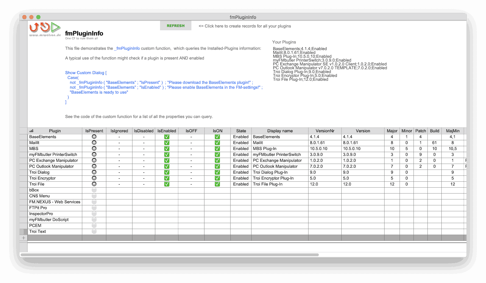

[![fmPluginInfo logo][fmPluginInfo logo]][fmPluginInfo home]

# fmPluginInfo
[One CF to rule them all!]

A file demonstrating the _PluginInfo custom function which can tell you everything you want to know about your plugins.

- [fmPluginInfo home][fmPluginInfo home]
- [fmPluginInfo repo][fmPluginInfo repo]

It's open source under [MIT License](LICENSE) ... so have fun!

MrWatson

[![mrwatson.de][mrwatson.de logo]][mrwatson.de]

[fmPluginInfo home]:https://www.fmworkmate.com/fmplugininfo
[fmPluginInfo repo]:https://github.com/mrwatson-de/fmPluginInfo
[fmPluginInfo logo]:fmPluginInfo2_sm.png
[mrwatson.de logo]:www.mrwatson.de_neon_256.png
[mrwatson.de]:http://www.mrwatson.de
